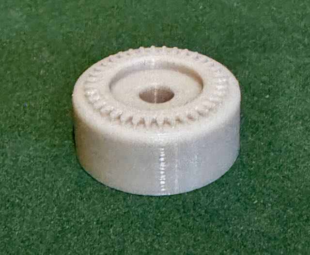

# OpenSCAD Quad Lock 360 Base

A base adapter for [Quad Lock 360](https://www.quadlockcase.com) mounting components. I had a project where I need
to create a base for a Quad Lock 360 MAG Wireless Charging Head. Not finding one in
OpenSCAD, I put this together. The intention is for this component to be incorporated
into your 3D models as needed.

## The `quadlock_base` Module

The `quadlock_base` module take in the following parameters.

| Parameter            | Description                                                                                                     | Default |
| -------------------- | --------------------------------------------------------------------------------------------------------------- | ------- |
| base_height          | The height of the base below the locking gear. Be aware that the locking gear add 1mm to to the overall height. | 6mm     |
| base_diameter        | The diameter of the base below the locking gear.                                                                | 24.5mm  |
| screw_shaft_diameter | Diameter of the screw shaft.                                                                                    | 5.5mm   |
|                      |                                                                                                                 |         |

## Dependencies and Using the Component

This model is built using the tools listed below. Install these tools and you can open up the SCAD file in 
this repo to create your own printable object. 

- [OpenSCAD](https://openscad.org)
- [The Belfry OpenScad Library, v2.0.](https://github.com/BelfrySCAD/BOSL2)

## Example Output

The file `test-quadlock-base.scad` shows a simple test of instantiating and using the Quad Lock base.

